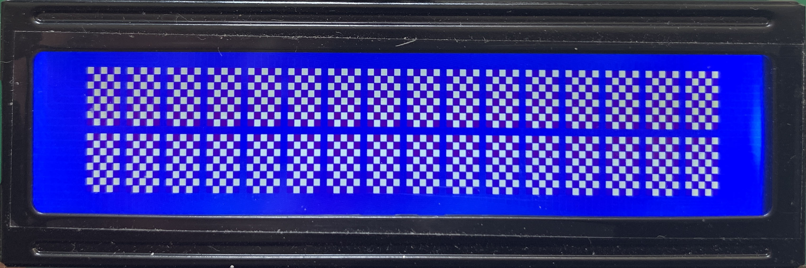
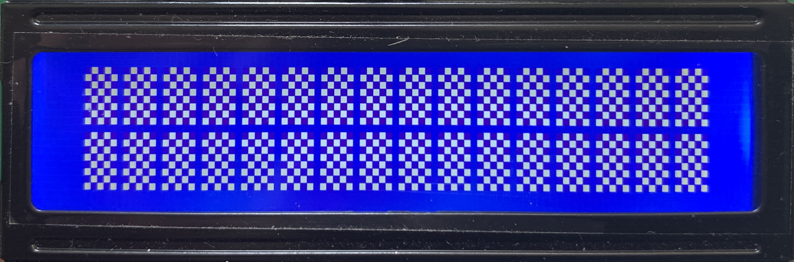
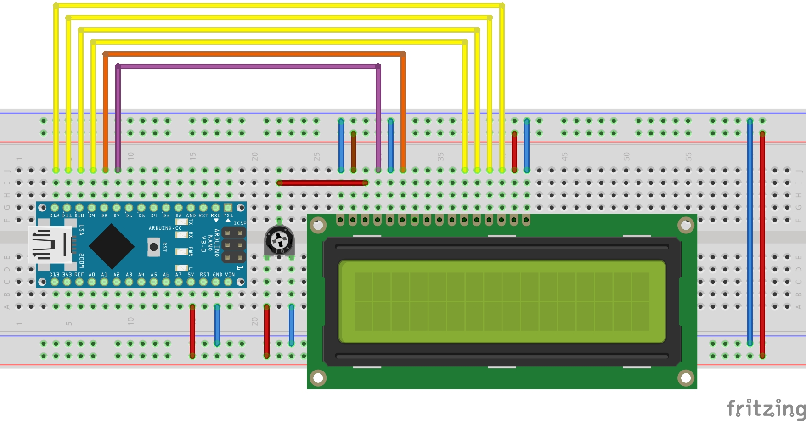

 
# **1602-LCD-PixelCheck**
**Arduino IDE file for a 1602 LCD pixel and backlight check**

 
This is a simple Arduino (and C++) repo for testing your LCD display type LCD1602 or LCD1602A. 
If you have an Liquid-crystal display type LCD1602 or LCD1602A you can connect as the schematic and upload the sketch. 
As a result you will get the "Odd" and "Even" pixels one at the time.
   

 

## Notes
- Connect the **1602 LCD** according to the schematic
- *See schematic pinsettings*
- After upload to the arduino every second you'll see the even or the odd pixels lite up...

 
 

## Output will look like this

 

Odd | Even
---------|----------
  | 

 

## Schematic

 

The Schematic for the pinsettings

